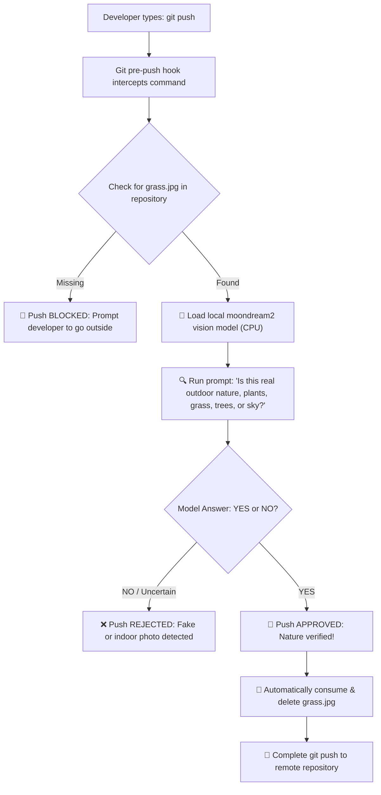

# 🌿 Touch Grass to Deploy

[](https://dev.to)
[](https://huggingface.co/vikhyatk/moondream2)
[](https://hacktoberfest.com)
[](LICENSE)
[]()

> **A Git `pre-push` gatekeeper powered by local, open-weight vision AI (`moondream2`). It intercepts every `git push` across your repositories and blocks deployment until you physically step away from your monitor, go outside, and provide authentic photographic evidence of nature.**

---

## 📌 Submission Information
- **Challenge:** DEV Community x Hugging Face Hacktoberfest 2026 Challenge (Week 1)
- **Theme:** *"Touch Grass"* Building tools where the screen is the *shortest part of the experience*.
- **Tags:** `#devchallenge` `#hf26challenge`

---

## 🩺 The Problem: The Infinite Screen Loop

As software engineers, we pride ourselves on automated CI/CD pipelines, instant deployments, and hyper-productive terminal workflows. But that relentless cycle comes with an insidious cost:

- **Uninterrupted screen trance:** Hours blur into days as developers remain chained to glowing displays, chasing down edge cases and deployment flags.
- **Physical disconnect:** Burnout, eye strain, and postural fatigue compound when the physical world outside is reduced to wallpaper imagery.
- **Fake breaks:** Walking to the kitchen or switching tabs from VS Code to Reddit isn't disconnecting; it's just swapping one screen for another.

We need a hard boundary. What if your code literally **refused to deploy** unless you stepped outside and touched real grass?

---

## 💡 The Solution: Proof-of-Nature Pre-Push Gatekeeper

**"Touch Grass to Deploy"** is an open-source Git gatekeeper. Whenever you run:

```bash
git push
```

The hook pauses your terminal, verifies that a fresh proof image (`grass.jpg`) exists in your project directory, and feeds it into **`vikhyatk/moondream2`** — an open-weight vision-language model executing **100% locally on your CPU**.

If the local vision model detects genuine foliage, grass, trees, or outdoor sky, your push is **authorized**, the photo is consumed (requiring fresh proof for future deploys), and your code ships to the remote. If you haven't stepped outside or tried to feed it a screenshot of a terminal, an indoor wall, or desktop wallpapers the push is **aborted**.

---

## 🧠 Why Open Source AI Matters

This project was built to champion open innovation and open-weight models. Here is why an open, local approach was mandatory:

### 1. 📴 Zero Cloud Dependency (Works in the Wild)
If you're coding from an off-grid cabin, a hiking trail with spotty cell service, or a park bench with no Wi-Fi, you shouldn't be barred from local git verification. Because `moondream2` runs entirely on device with PyTorch CPU optimizations, the gatekeeper requires **zero internet access** and **zero external API keys**.

### 2. 💸 Zero Cost Barrier & No Rate Limits
Proprietary multimodal APIs charge per token/image and enforce rate limits. With open-weight AI, verification is **free forever**. Developers can push code without running up a cloud billing invoice.

### 3. 🔒 Complete Privacy & Metadata Security
Real-world photos taken on smartphones contain sensitive metadata: GPS coordinates, device identifiers, and background glimpses of personal spaces. By running inference strictly inside local RAM, **not a single pixel or byte of EXIF metadata ever leaves your machine**.

---

## 🏗️ Architecture & Workflow



---

## ⚙️ Model Details

| Attribute | Specification |
| :--- | :--- |
| **Model** | [`vikhyatk/moondream2`](https://huggingface.co/vikhyatk/moondream2) |
| **Model Revision** | `2024-08-26` |
| **Parameters** | ~1.86 Billion |
| **Hardware Target** | Consumer CPU (x86_64 / ARM64), 8GB–16GB RAM |
| **Optimizations** | `low_cpu_mem_usage=True`, evaluated under `torch.no_grad()` |
| **License** | Apache 2.0 (Open Weights) |

---

## 🚀 Installation & Setup

### Prerequisites
* Python 3.9+ installed
* Git installed

### 1. Clone & Install Dependencies
Clone this repository to a permanent location on your computer:

```bash
git clone https://github.com/AmjustGettingStarted/touch-grass-to-deploy.git
cd touch-grass-to-deploy

# Install dependencies (CPU friendly)
pip install -r requirements.txt
```

---

### Option A: Global Mode (Recommended — Protect ALL Repositories)
Enforce the gatekeeper across every single project on your machine so you can't push code anywhere without touching grass.

#### Automated Setup (One Command):
```bash
python setup_hook.py --global
```

#### Manual Setup:
1. **Create a global hooks directory:**
   ```bash
   # Linux / macOS:
   mkdir -p ~/.githooks

   # Windows (PowerShell):
   mkdir "$HOME\.githooks"
   ```

2. **Configure Git to use global hooks:**
   ```bash
   git config --global core.hooksPath ~/.githooks
   ```

3. **Link the pre-push script:**
   Create an executable file at `~/.githooks/pre-push` containing:
   ```bash
   #!/bin/sh
   # Update path to where you cloned touch-grass-to-deploy
   python "/path/to/touch-grass-to-deploy/verify_grass.py"

   if [ $? -ne 0 ]; then
       exit 1
   fi
   exit 0
   ```

Now, running `git push` in **any** project repository on your machine will require physical proof of nature!

---

### Option B: Local Mode (Single Repository Only)
If you only want to enforce this gatekeeper on a single specific repository:

Inside that repository's directory, run:
```bash
python /path/to/touch-grass-to-deploy/setup_hook.py
```

This automatically links the hook into `.git/hooks/pre-push` for that project only.

---

## 🖥️ Terminal Experience Walkthrough

### Scenario A: Attempting to Push Without Stepping Outside
```text
$ git push origin main

======================================================================
  🌿 TOUCH GRASS TO DEPLOY | Git Pre-Push Gatekeeper 🌿
  Dev Community x Hugging Face Hacktoberfest Challenge
======================================================================

🚫 DEPLOYMENT BLOCKED: NO PROOF OF NATURE FOUND!
----------------------------------------------------------------------
You have attempted to `git push` without providing physical evidence
that you have stepped away from your screen.

👉 HOW TO UNLOCK YOUR GIT PUSH:
  1. Stand up from your desk.
  2. Walk outside into the physical world.
  3. Touch real grass, foliage, or gaze at the sky.
  4. Snap a photo on your phone.
  5. Save the photo as grass.jpg in your project root:
     /path/to/your/project/grass.jpg
  6. Re-run `git push`.

"The screen should be the shortest part of the experience."
----------------------------------------------------------------------

❌ git push aborted by Touch Grass gatekeeper.
error: failed to push some refs to remote
```

---

### Scenario B: Trying to Cheat with an Indoor or Monitor Screenshot
```text
$ git push origin main

======================================================================
  🌿 TOUCH GRASS TO DEPLOY | Git Pre-Push Gatekeeper 🌿
  Dev Community x Hugging Face Hacktoberfest Challenge
======================================================================
Found candidate proof: grass.jpg

[1/3] 📷 Inspecting proof: grass.jpg...
[2/3] 🧠 Initializing local vision model (vikhyatk/moondream2 on CPU)...
      (Zero cloud API calls. Complete offline privacy.)
[3/3] 🔍 Analyzing visual features for authentic outdoor nature...
      AI Model Verdict: NO

🚫 REJECTED: THIS DOES NOT LOOK LIKE REAL NATURE!
----------------------------------------------------------------------
Model response: NO

The local vision AI determined this image does NOT show authentic
outdoor nature, grass, plants, trees, or sky.

Please do not submit screenshots of code, indoor monitors, wallpapers,
or artificial renders. Go outside, touch real grass, take an authentic
photo, save it as grass.jpg, and re-run `git push`.
----------------------------------------------------------------------

❌ git push aborted by Touch Grass gatekeeper.
```

---

### Scenario C: Nature Confirmed & Deployed!
```text
$ git push origin main

======================================================================
  🌿 TOUCH GRASS TO DEPLOY | Git Pre-Push Gatekeeper 🌿
  Dev Community x Hugging Face Hacktoberfest Challenge
======================================================================
Found candidate proof: grass.jpg

[1/3] 📷 Inspecting proof: grass.jpg...
[2/3] 🧠 Initializing local vision model (vikhyatk/moondream2 on CPU)...
      (Zero cloud API calls. Complete offline privacy.)
[3/3] 🔍 Analyzing visual features for authentic outdoor nature...
      AI Model Verdict: YES

✅ PROOF ACCEPTED! NATURE CONFIRMED.
----------------------------------------------------------------------
🌿 Congratulations! You touched grass and disconnected from the matrix.
🚀 Your git push has been authorized by local vision intelligence.

🧹 Consumed grass.jpg (fresh proof required for future pushes).

Proceeding with remote deployment...

Enumerating objects: 5, done.
Writing objects: 100% (5/5), done.
To https://github.com/AmjustGettingStarted/touch-grass-to-deploy.git
   d93db72..1a2b3c4  main -> main
```

---

## 🧪 Testing Standalone & Emergency Bypass

Test the verification script directly without running a git push:

```bash
# Test with missing proof
python verify_grass.py

# Test with a specific image without deleting it
python verify_grass.py --image path/to/sample.jpg --keep-image

# Run in dry-run mode
python verify_grass.py --dry-run
```

To uninstall hooks:
```bash
# Uninstall local hook
python setup_hook.py --uninstall

# Uninstall global hook
python setup_hook.py --global --uninstall
```

### 🚨 Emergency Bypass
In a critical production hotfix where you cannot immediately step outside:
```bash
git push --no-verify
```
*(Use sparingly! Your mental and physical health matters more than continuous deployment.)*

---

## 🗂️ Project Structure

```text
touch-grass-to-deploy/
├── .git/
│   └── hooks/
│       └── pre-push              # Native git hook executing verification
├── verify_grass.py               # Core vision pipeline loading moondream2 & evaluating proof
├── setup_hook.py                 # Installer for Local and Global git hooks
├── requirements.txt              # Minimal dependencies (PyTorch CPU, Transformers, Pillow)
├── .gitignore                    # Ensures grass.jpg & virtual environments are never committed
├── LICENSE                       # Open-source MIT License
└── README.md                     # Documentation & DEV Hacktoberfest challenge write-up
```

---

## 📜 License
This project is open-source under the [MIT License](LICENSE).

---

*Built with ❤️, open-source AI, and fresh outdoor air for the DEV Community x Hugging Face Hacktoberfest 2026 Challenge.*
